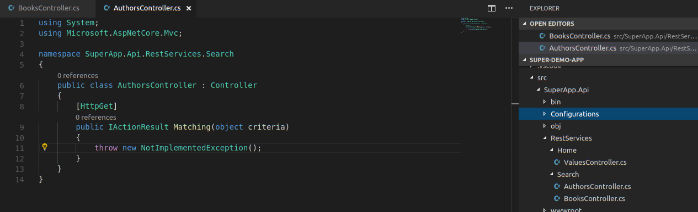

# Dotnet-Core-WebAPI-Routing

Pre-built routing utilities for dotnet Core WebAPI projects


## Usage

Classic style routing for all controllers to use routing convention `"/api/[controller]"`

```
    public class Startup
    {
        ...
        // This method gets called by the runtime. Use this method to add services to the container.
        public void ConfigureServices(IServiceCollection services)
        {
            services
                // Default MVC style route for API controller
                //      Static text followed by Controller name used for route
                .AddMvc(options => options.Conventions.Insert(0, new RouteTemplateRoutingConvention(new RouteAttribute("api/[controller]"))));
        }

        ...
    }
```

Namespace-based routing using `ControllerSpecific` routing convention. Great for Feature Slice code organized by namespace.


This example should produce routes such as`"Search/Authors/Matching"`

```
    public class Startup
    {
        ...

        // This method gets called by the runtime. Use this method to add services to the container.
        public void ConfigureServices(IServiceCollection services)
        {
            services
                // Feature-slice routing
                //    Namespace after BaseNameSpace and Controller are used for route
                .AddMvc(options => options.Conventions.Insert(0, new ControllerSpecificRoutingConvention(controller =>
                {
                    const string BaseNameSpace = "RestServices";

                    var vRouteStringTemplate =
                        string.Join("/", 
                            controller.ControllerType.Namespace
                            .Split(".")
                            .SkipWhile(name => !name.Equals(BaseNameSpace, StringComparison.CurrentCultureIgnoreCase))
                            .Skip(1)
                            .Append("[controller]"));

                    return new AttributeRouteModel(new RouteAttribute(vRouteStringTemplate));
                })));
        }

        ...
    }
```